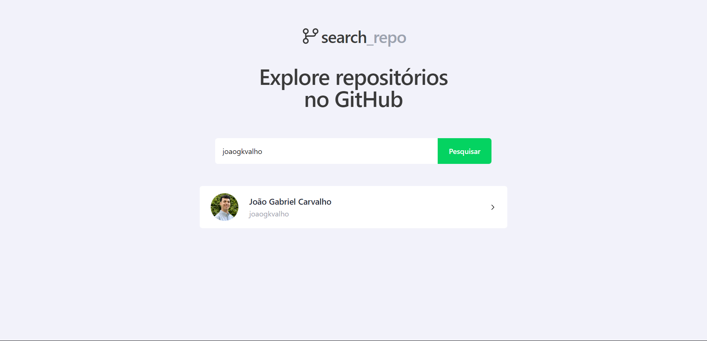

<h1 align="center"> search-repoV2 </h1>

  <a href="#-tecnologias">Tecnologias</a>&nbsp;&nbsp;&nbsp;|&nbsp;&nbsp;&nbsp;
  <a href="#-projeto">Projeto</a>&nbsp;&nbsp;&nbsp;|&nbsp;&nbsp;&nbsp;
  <a href="#memo-licença">Licença</a>

  

 

  

## 🚀 Tecnologias

Esse projeto foi desenvolvido com as seguintes tecnologias:

- ReactJS
- TailwindCSS
- React Toastfy

## 🔥 Algumas features neste projeto

- Layout simples, clean e moderno aprimorado da versão antiga criado com TailwindCSS
- Layout totalmente responsivo
- Mensagens de erro com React Toastfy

## 💻 Projeto

- SearchRepoV2 é a segunda versão do SearchRepo com layout aprimorado, novas funcionalidades e estilizado com TailwindCSS.

## 📝 Licença

Esse projeto está sob a licença MIT.

---
